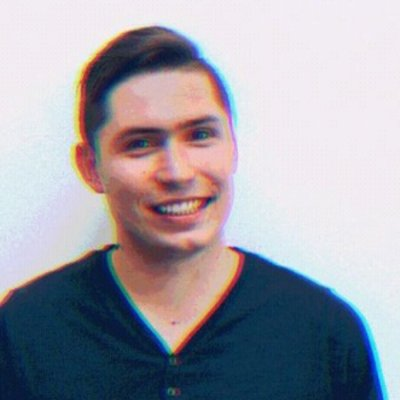

class: middle, center, slide-1

# WarsawJS Workshop #6

---

class: middle, center

# I część: organizacyjna

---

class: middle, center

# Obiad

## [bit.ly/warsawjs-workshop-6-lunch][lunch]

---

class: middle, center, slide-card-list

### Organizatorzy

.card[ Piotr Kowalski]
.card[ Katarzyna Grabowska]
.card[ Piotr Zientara]

---

class: middle, center, slide-card-list

### &#x1F4DA; Trenerzy &#x1F4DA;

.card[ Igor Pasieczny]
.card[ Łukasz Jagodziński]
.card[ Marcin Hagmajer]
.card[ Szymon Paluch]

---

class: middle, center

---

### Zasady współpracy

* Podział na grupy pod kątem zaawansowania podczas selekcji
* Trener decyduje o prędkości realizacji projektu
* To nie są indywidualne zajęcia
* Odnosimy się do siebie po koleżeńsku (na Ty)
* Każdy z uczestników wyraża zgodę na publikację wizerunku w social mediach

A najważniejsza zasada to...

---

class: middle, center

# Żadne pytanie nie jest głupie!

---

### Przerwy

* Przerwa kawowa: **11:30 - 11:45** 
* Przerwa obiadowa: **13:00 - 13:30**
* Przerwa kawowa: **15:30 - 15:45**

Dodatkowe przerwy, o których decyduje trener.

---

class: middle, center

### Nazwa projektu

## `warsawjs-workshop-6-whiteboard`

---

### Zakończenie

* Kodowanie kończymy o **18:00**
* Ankiety: [bit.ly/warsawjs-workshop-6-ankieta][ankieta]
* Chętni wychodzą na scenę ze swoim projektem
* &#x2728;&#0160; Bonus na zakończenie!

---

class: middle, center

# Poznajmy się &#x1F600;

---

class: middle

# Pokaż jak się koduje! &#x1F600;

## 1. Zrób zdjęcie podczas warsztatów
## 2. Opublikuj na Twitterze z tagiem `#warsawjs`
## 3. Weź udział w losowaniu upominku! &#x1F455;

---

class: middle, center, slide-card-list

### **WarsawJS** w mediach społecznościowych

.card[ [meetup.com](http://meetup.com/warsawjs)]
.card[ [twitter.com](http://twitter.com/warsawjs)]
.card[ [facebook.com](http://facebook.com/warsawjs)]
.card[ [youtube.com](http://youtube.com/warsawjs)]

---

class: middle, center

# Koniec części organizacyjnej

---

class: slide-1

### WarsawJS Workshop #6

* Nazwa projektu: `warsawjs-workshop-6-whiteboard`
* Przerwy:
    - kawowa: **11:30 - 11:45** 
    - obiadowa: **13:00 - 13:30**
    - kawowa: **15:30 - 15:45**
* Zakończenie kodowania **18:00** &#x26D4;
* Zrób zdjęcie, opublikuj je na Twitterze z `#warsawjs` i wygraj konkurs! &#x1F455;
* Ankiety
    - lunch: [bit.ly/warsawjs-workshop-6-lunch][lunch]
    - podsumowanie: [bit.ly/warsawjs-workshop-6-ankieta][ankieta]

---

class: middle, center

# Odliczanie czasu do końca warsztatów

https://piecioshka.github.io/countdown/

---

class: middle, center

# Koniec &#x23F0; o 18:00

## &#x2728; Dyplomy &#x2728;
## Ankieta: [bit.ly/warsawjs-workshop-6-ankieta][ankieta]

---

class: middle

# Kto chce pochwalić się swoim projektem? &#x1F4A5;

1. Opis podstawowych funkcjonalności (przeklikanie)
2. Pokazanie unikalnego feature-a
3. Najfajniejsze miejsce w kodzie
4. Jaki jest największy problem?

---

class: middle, center

# Losowanie nagród &#x1F381;

## [Twitter][twitter-hashtag]: `#warsawjs`

---

class: middle, center

# Dzięki za przybycie! &#x1F389;
 
## Kolejne warsztaty: `Web Components`
## <mark>Szukamy trenerów!</mark>

[ankieta]: http://bit.ly/warsawjs-workshop-6-ankieta
[lunch]: http://bit.ly/warsawjs-workshop-6-lunch
[twitter-hashtag]: https://twitter.com/search?f=tweets&vertical=default&q=%23warsawjs

