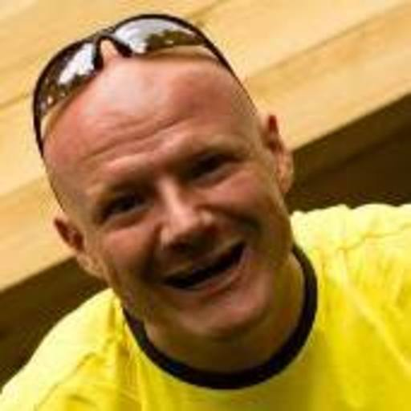
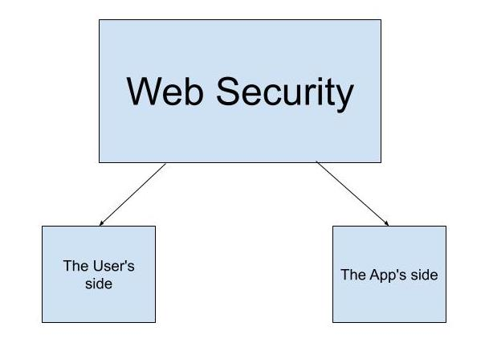
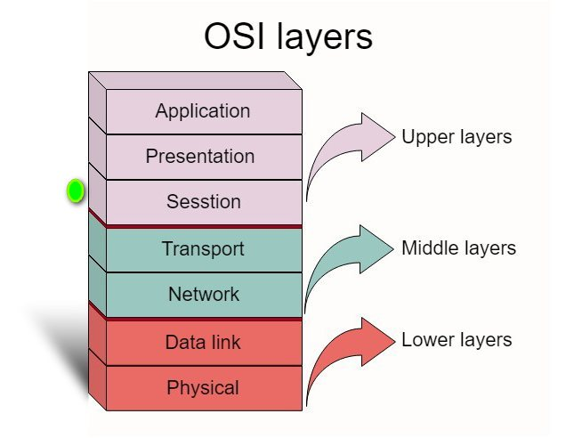

class: middle, slide-front-page

.size130[

# WarsawJS Workshop #<span class="ordometer js-workshop-number">???</span>

]

---


class: middle, center, slide-card-list

.size50[

# Trenerzy Grupy IV

]

.card[ Sijawusz Pur Rahnama]
.card[ Piotr Zientara]


---

class: middle, center, slide-card-list, no-display-twitter-handle, no-logo

.size50[

# Trener wspomagający

]

.card[ Illarion Koperski]

<!-- .card[ Natalia Kędziora]
.card[ Tatiana Platonova] -->

<!-- .card[ Łukasz Basaj] -->
<!-- .card[] -->

<!-- .card[ Genia Kai] -->
<!-- .card[ Piotr Szlachciak] -->
<!-- .card[ Piotr Sławiński] -->
<!-- .card[ Nataliya Pasichnyk] -->
<!-- .card[ Tatiana Platonova] -->
<!-- .card[ Bartosz Legięć] -->
<!-- .card[ Łukasz Basaj] -->
<!-- .card[ Ula Kaźmierczyk] -->
<!-- .card[ Jacek Mikrut] -->
<!-- .card[ Piotr Łysik] -->
<!-- .card[ Kamil Gebała] -->
<!-- .card[ Natalia Kędziora] -->
<!-- .card[ Kinga Wigurska-Bąk] -->
<!-- .card[ Przemysław Rząd] -->
<!-- .card[ Barbara Kłosowska] -->
<!-- .card[ Kamil Gajowy] -->
<!-- .card[ Konrad Kowalski] -->


---

.size50[

# Zasady współpracy 📋

]

### Na luzaku
### Zamiast na efekt w kodzie, 
### nastawienie na wiedzę i rozumienie problemów

---

class: middle, center

.size70[

# Pytajcie odważnie o security!

]

---

class: middle, center, no-logo

# Slack

<svg width="200" height="200" viewBox="0 0 256 256" xmlns="http://www.w3.org/2000/svg" preserveAspectRatio="xMidYMid"><path d="M165.964 15.838c-3.89-11.975-16.752-18.528-28.725-14.636-11.975 3.89-18.528 16.752-14.636 28.725l58.947 181.365c4.048 11.187 16.132 17.473 27.732 14.135 12.1-3.483 19.475-16.334 15.614-28.217L165.964 15.838" fill="#DFA22F"/><path d="M74.626 45.516C70.734 33.542 57.873 26.989 45.9 30.879 33.924 34.77 27.37 47.631 31.263 59.606l58.948 181.366c4.047 11.186 16.132 17.473 27.732 14.132 12.099-3.481 19.474-16.332 15.613-28.217L74.626 45.516" fill="#3CB187"/><path d="M240.162 166.045c11.975-3.89 18.526-16.75 14.636-28.726-3.89-11.973-16.752-18.527-28.725-14.636L44.708 181.632c-11.187 4.046-17.473 16.13-14.135 27.73 3.483 12.099 16.334 19.475 28.217 15.614l181.372-58.93" fill="#CE1E5B"/><path d="M82.508 217.27l43.347-14.084-14.086-43.352-43.35 14.09 14.089 43.347" fill="#392538"/><path d="M173.847 187.591c16.388-5.323 31.62-10.273 43.348-14.084l-14.088-43.36-43.35 14.09 14.09 43.354" fill="#BB242A"/><path d="M210.484 74.706c11.974-3.89 18.527-16.751 14.637-28.727-3.89-11.973-16.752-18.526-28.727-14.636L15.028 90.293C3.842 94.337-2.445 106.422.896 118.022c3.481 12.098 16.332 19.474 28.217 15.613l181.371-58.93" fill="#72C5CD"/><path d="M52.822 125.933c11.805-3.836 27.025-8.782 43.354-14.086-5.323-16.39-10.273-31.622-14.084-43.352l-43.36 14.092 14.09 43.346" fill="#248C73"/><path d="M144.16 96.256l43.356-14.088a546179.21 546179.21 0 0 0-14.089-43.36L130.07 52.9l14.09 43.356" fill="#62803A"/></svg>

## #workshop-40

**Centrum komunikacji**

---

# Przerwy 🏖

.size50[

* Social media break: **11:30 — 11:45**
* Lunch: **13:00 — 13:45**
* Activity break: **15:30 — 15:45**

]

Możliwe są dodatkowe przerwy, o których decyduje trener.

---

class: middle, center

# 💎 Nazwa projektu 💎

.size50[

## <mark>warsawjs-workshop-40-4-security</mark>

]

---


class: middle



---

class: middle



---

class: middle

## Who are the attackers and what is their point?
1. Grey hats,
2. Black hats, 
3. Botnets, 
4. People working in stealing data business

---

class: middle

## Quotes
"We need to make one thing clear — <br>
everything you put in the client browser can be easily changed by the client."

"Backend is the deciding factor"


---

class: middle

## Security
1. Promote AddBlock, encription, UBlock as "digital BHP"
2. Create secure software
3. We're programmers, so we need to teach others!


---

class: middle

## Security cases
* alert box which is not an alert box! <br>
"your system is very dirty! Can we clean it for 5$?"

* Front-end has plenty of priviledges:
frontend can run a sandbox operation system
webGL, Shaders, Wasm
* electron enables JS in desktop - there will be more security issues with JS, which is very complicated - as complicated as the backend - JS

* Malware as a service - 20$ per month ;-)


---

class: middle

## What can we do?
1. Promote AddBlock, encription, UBlock as "digital BHP"
2. Create secure software
3. We're programmers, so we need to teach others!

---

class: middle

## What can be the frontend issue?
1. limit users from accessing certain parts of the site is not effective
2. data is leaking (might happen we only hide some data on the Front-end)
3. Front-end only validations (can be skipped by through inspector)

---

class: middle

## Look at this piece of code 🤔

```

```

---

class: middle, center, slide-middle-images, no-logo, slide-card-list,


.size50[

# Chinese attack on GitHub 

]


---


class: middle, center, slide-middle-images, no-logo, slide-card-list,


.size50[

# Security issues on Frontend

]

1. XSS (Cross-Site Scripting)
2. CSRF (Cross-Site Request Forgery)
3. CORS (Cross-Origin Resource Sharing)


---

class: middle

## What we excercise?
1. XSS - onet shackował naszą stronę! Z naszego localhost jesteśmy przekierowani na ich page i generujemy sztuczny ruch"
2. Trick noopener
3. CSS swap!

---

class: middle

## Server response codes
* 401 - not authenticated
* 403 - not authorized
* 5** - server error 
* 3** - redirect

---

class: middle

## Some good frontend practices
* use `Secure` flag on cookies
* use `httpOnly` flag on requests
* don't use innerHTML for form inputs as it can cause a script to run
* use `rel=noopener` https://mathiasbynens.github.io/rel-noopener/


---

class: middle

## Sources  

1. https://owasp.org/
2. http://vulnerable-bank.com/app_v3_banking.php
3. https://medium.com/@baphemot/understanding-react-frontend-security-4963d35feea7
4. https://owasp.org/www-community/attacks/xss/
5. https://developer.mozilla.org/en-US/docs/Web/HTTP/CORS
6. https://en.wikipedia.org/wiki/Cross-site_request_forgery
7. https://en.wikipedia.org/wiki/Session_layer
8. https://mathiasbynens.github.io/rel-noopener/

---

# Zakończenie

.size40[

* Kodowanie kończymy o **18:00**
* Ankieta: [bit.ly/warsawjs-workshop-40-ankieta](https://bit.ly/warsawjs-workshop-40-ankieta)
* **Zapraszamy na scenę, aby opowiedzieć o dzisiejszym doświadczeniu - Prezenty dla chętnych**

]

---


exclude: true
class: middle, center, slide-card-list

### **WarsawJS** w mediach społecznościowych

.card[ [meetup.com](http://meetup.com/warsawjs)]
.card[ [twitter.com](http://twitter.com/warsawjs)]

.card[ [facebook.com](http://facebook.com/warsawjs)]
.card[ [youtube.com](http://youtube.com/warsawjs)]

---

class: middle

# Pokaż jak się koduje! ⌨️

## 1. Zrób zdjęcie podczas warsztatów 📲

## 2. Opublikuj w mediach z tagiem `#warsawjs`

## 3. Weź udział w losowaniu upominku! &#x1F455;

---

class: middle, center

# Koniec &#x23F0; o <mark>18:00</mark>

---

class: middle

# Ankieta 📑

## [bit.ly/warsawjs-workshop-40-ankieta](https://bit.ly/warsawjs-workshop-40-ankieta)

* Dziękujemy za wypełnienie ankiet
* Dzięki nim możemy się rozwijać
* Ankieta jest anonimowa

