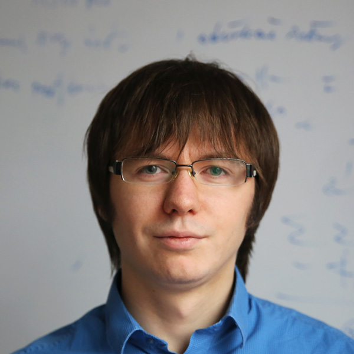
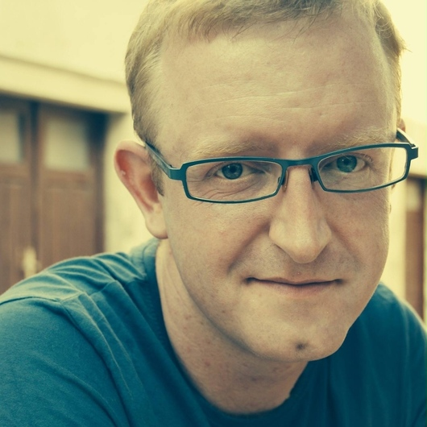

class: middle, center, slide-1

# WarsawJS Workshop #5

---

class: middle, center

# I część: organizacyjna

---

class: middle, center, slide-card-list

### Organizatorzy

.card[ Piotr Kowalski]
.card[ Katarzyna Grabowska]
.card[ Piotr Zientara]

---

class: middle, center, slide-card-list

### Trenerzy

.card[ Marek Święcicki]
.card[ Kamil Grabek]
.card[ Konrad Kowalski]
.card[ Robert Kawecki]
.card[ Tomasz Marciszewski]

---

class: middle, center

---

### Zasady współpracy

* Podział na grupy pod kątem zaawansowania podczas selekcji
* To nie są indywidualne zajęcia
* Odnosimy się do siebie po koleżeńsku (na Ty)
* Trener decyduje o prędkości realizacji projektu
* Uczestnicy przedstawiają się trenerowi
* Każdy z uczestników wyraża zgodę na publikację wizerunku w social mediach

A najważniejsza zasada to...

---

class: middle, center

# Nie ma głupich pytań

---

### Przerwy

* Przerwa kawowa: 11:30 - 11:45 
* Przerwa obiadowa: 13:00 - 13:30
* Przerwa kawowa: 15:30 - 15:45 

Dodatkowe przerwy, o których decyduje trener.

---

### Zakończenie

* Kodowanie kończymy o 18:00
* Ankiety: [bit.ly/warsawjs-workshop-5-ankieta](http://bit.ly/warsawjs-workshop-5-ankieta)
* Chętni wychodzą na scenę ze swoim projektem
* &#x2728;&#0160; Bonus na zakończenie!

---

class: middle, center

# Poznajmy się &#x1F600;

---

class: middle, center, slide-card-list

### **WarsawJS** w mediach społecznościowych

.card[ [twitter.com](http://twitter.com/warsawjs)]
.card[ [warsawjs.com](http://warsawjs.com/)]
.card[ [facebook.com](http://facebook.com/warsawjs)]
.card[ [meetup.com](http://meetup.com/warsawjs)]
.card[ [youtube.com](http://youtube.com/warsawjs)]

---

class: middle, center

# Pokaż jak się koduje! &#x1F600;
## Zrób zdjęcie podczas warsztatów z tagiem `#warsawjs` a weźmiesz udział w losowaniu upominku!

---

class: middle, center

# Koniec części organizacyjnej

---

class: middle, center

# Koniec &#x23F0; o 18:00

## &#x2728; Dyplomy &#x2728;
## Ankieta: [bit.ly/warsawjs-workshop-5-ankieta](http://bit.ly/warsawjs-workshop-5-ankieta)

---

class: middle, center

# Kto chce pochwalić się swoim projektem?

---

### Relacja live &#x1F3AC;

- Rozpoczęcie WarsawJS Workshop #5
    - https://youtu.be/NY2mvJ578tY
- Prezentacja aplikacji docelowej przez mentora podczas WarsawJS Workshop #5
    - https://youtu.be/PfvgR3I9rkA
- Rozmowa z trenerami WarsawJS Workshop #5
    - https://youtu.be/h2Yyr6Xy5aI
- Rozmowa z mentorem WarsawJS Workshop #5
    - https://youtu.be/j0xHF-td9DA
- Rozmowa z uczestnikami WarsawJS Workshop #5
    - https://youtu.be/9b21X7d_vkw
- Rozmowa ze współorganizatorem podczas WarsawJS Workshop #5
    - https://youtu.be/IGbjms2ZAcE

---

class: middle, center

# Losowanie nagród

## Twitter: `#warsawjs`

---

class: middle, center

# Konferencja `JS Poland`

## Darmowe `3 bilety` oraz zniżka `#warsawjs`

---

class: middle, center

# Kolejne warsztaty:

# `Meteor.js`

## Szukamy trenerów!
