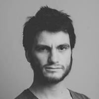
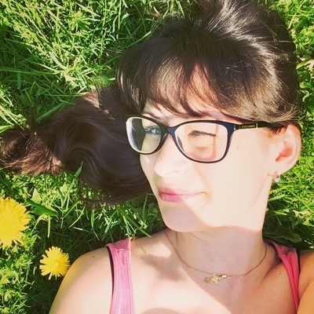
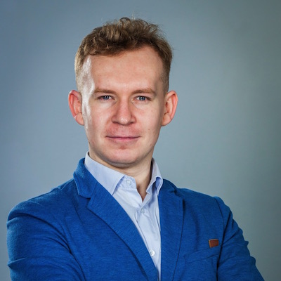
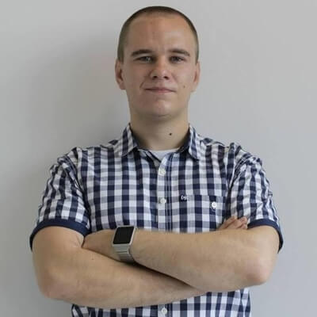
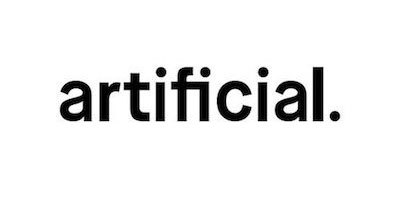
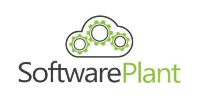
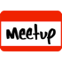

class: middle, center, slide-1

.size130[
# WarsawJS Workshop #18
]

---

class: middle, center

# I część: organizacyjna

---

exclude: true
class: middle, center

# Obiad

## [bit.ly/warsawjs-workshop-18-lunch][lunch]

---

class: middle, center

# Slack

## #workshop-18

*Dostęp możliwy, kiedy dostaniesz zaproszenie.*
 

<svg width="200" height="200" viewBox="0 0 256 256" xmlns="http://www.w3.org/2000/svg" preserveAspectRatio="xMidYMid"><path d="M165.964 15.838c-3.89-11.975-16.752-18.528-28.725-14.636-11.975 3.89-18.528 16.752-14.636 28.725l58.947 181.365c4.048 11.187 16.132 17.473 27.732 14.135 12.1-3.483 19.475-16.334 15.614-28.217L165.964 15.838" fill="#DFA22F"/><path d="M74.626 45.516C70.734 33.542 57.873 26.989 45.9 30.879 33.924 34.77 27.37 47.631 31.263 59.606l58.948 181.366c4.047 11.186 16.132 17.473 27.732 14.132 12.099-3.481 19.474-16.332 15.613-28.217L74.626 45.516" fill="#3CB187"/><path d="M240.162 166.045c11.975-3.89 18.526-16.75 14.636-28.726-3.89-11.973-16.752-18.527-28.725-14.636L44.708 181.632c-11.187 4.046-17.473 16.13-14.135 27.73 3.483 12.099 16.334 19.475 28.217 15.614l181.372-58.93" fill="#CE1E5B"/><path d="M82.508 217.27l43.347-14.084-14.086-43.352-43.35 14.09 14.089 43.347" fill="#392538"/><path d="M173.847 187.591c16.388-5.323 31.62-10.273 43.348-14.084l-14.088-43.36-43.35 14.09 14.09 43.354" fill="#BB242A"/><path d="M210.484 74.706c11.974-3.89 18.527-16.751 14.637-28.727-3.89-11.973-16.752-18.526-28.727-14.636L15.028 90.293C3.842 94.337-2.445 106.422.896 118.022c3.481 12.098 16.332 19.474 28.217 15.613l181.371-58.93" fill="#72C5CD"/><path d="M52.822 125.933c11.805-3.836 27.025-8.782 43.354-14.086-5.323-16.39-10.273-31.622-14.084-43.352l-43.36 14.092 14.09 43.346" fill="#248C73"/><path d="M144.16 96.256l43.356-14.088a546179.21 546179.21 0 0 0-14.089-43.36L130.07 52.9l14.09 43.356" fill="#62803A"/></svg>

---

class: middle, center, slide-card-list

### Organizatorzy

.card[ Piotr Kowalski]
.card[ Katarzyna Grabowska]
.card[ Piotr Zientara]

---

class: middle, center, slide-card-list

### Wolontariusze

.card[ Tomasz Budrewicz]
.card[ Kinga Wigurska-Bąk]
.card[ Natalia Kędziora]
.card[ Mirosław Stasiak]
.card[ Tatiana Platonova]

---

class: middle, center, slide-card-list

### &#x1F4DA; Trenerzy &#x1F4DA;

.card[ Piotr Kowalski]
.card[ Tatiana Platonova]
.card[ Piotr Zientara]
.card[ Daniel Siwek]
.card[ Leonid Logvinov]

---

class: middle, center

---

### Zasady współpracy 📋

* Podział na grupy pod kątem zaawansowania (efekt selekcji)

> **Jeśli trafiłeś do grupy z nieodpowiednim dla Ciebie poziomem, daj znać!**

* Trener decyduje o prędkości realizacji projektu
* Zajęcia grupowe - pomagamy sobie nawzajem
* Odnosimy się do siebie po koleżeńsku
* Każdy z uczestników wyraża zgodę na publikację wizerunku w social mediach

A najważniejsza zasada to...

---

class: middle, center

.size70[
# Żadne pytanie nie jest głupie!
]

---

exclude: true

### Przerwy

* Przerwa kawowa: **11:30 - 11:45** 
* Przerwa obiadowa: **13:00 - 13:30**
* Przerwa kawowa: **15:30 - 15:45**

Dodatkowe przerwy, o których decyduje trener.

---

class: middle, center

# 💎 Nazwa projektu 💎

.size50[
## <mark>warsawjs-workshop-18-topics-manager</mark>
]

---

# Zakończenie

.size40[
* Kodowanie kończymy o **18:00**
* Ankieta: [bit.ly/warsawjs-workshop-18-ankieta][ankieta]
* **Chętni wychodzą na scenę ze swoim projektem**
* &#x2728; Bonus na zakończenie! &#x2728; 
]

---

class: middle, center

.size120[
# Poznajmy się &#x1F600;
]

---

exclude: true
class: middle, center, slide-card-list

### **WarsawJS** w mediach społecznościowych

.card[ [meetup.com](http://meetup.com/warsawjs)]
.card[ [twitter.com](http://twitter.com/warsawjs)]
.card[ [facebook.com](http://facebook.com/warsawjs)]
.card[ [youtube.com](http://youtube.com/warsawjs)]

---

class: middle

# Pokaż jak się koduje! &#x1F600;

## 1. Zrób zdjęcie podczas warsztatów
## 2. Opublikuj w mediach z tagiem `#warsawjs`
## 3. Weź udział w losowaniu upominku! &#x1F455;

---

class: middle, center

# Koniec części organizacyjnej

---

class: slide-1

.size70[
# WarsawJS Workshop #18
]

.size40[
* Zrób zdjęcie, opublikuj je z hashtagiem `#warsawjs` i wygraj konkurs! &#x1F455;
* Zakończenie kodowania **18:00** &#x26D4;
* Ankieta: [bit.ly/warsawjs-workshop-18-ankieta][ankieta]

Nazwa projektu: `warsawjs-workshop-18-topics-manager`
]

---

class: middle, center

# Odliczanie czasu do końca warsztatów

https://piecioshka.github.io/countdown/#10:00

---

class: middle, center

# Koniec &#x23F0; o <mark>18:00</mark>

## &#x2728; Dyplomy &#x2728;
## Ankieta: [bit.ly/warsawjs-workshop-18-ankieta][ankieta]

---

class: middle

# Kto chce pochwalić się swoim projektem? &#x1F4A5;

1. Opis podstawowych funkcjonalności (przeklikanie)
2. Pokazanie unikalnego feature-a
3. Najfajniejsze miejsce w kodzie
4. Jaki jest największy problem?

---

class: middle, center

# Losowanie nagród &#x1F381;

## [Twitter][twitter-hashtag]: `#warsawjs`
## [Instagram][instagram-hashtag]: `#warsawjs`
## [Facebook][facebook-hashtag]: `#warsawjs`

---

class: middle, center

# Dzięki za przybycie! &#x1F389;

---

class: center, middle

# Prośba

.size50[
🙏 Wyrzućcie swoje śmieci do kosza 🙏
]

.size40[
📢 Dziękujemy 📢 
]

[ankieta]: http://bit.ly/warsawjs-workshop-14-ankieta
[lunch]: http://bit.ly/warsawjs-workshop-14-lunch
[twitter-hashtag]: https://twitter.com/hashtag/warsawjs?f=tweets&vertical=default
[instagram-hashtag]: https://www.instagram.com/explore/tags/warsawjs/
[facebook-hashtag]: https://www.facebook.com/hashtag/warsawjs
