class: middle, slide-front-page

.size130[

# WarsawJS Workshop #???

]

---

class: middle, center, slide-card-list, slide-card-list-rounded

.size50[

# Organizatorzy

]

.card[ Piotr Kowalski]
.card[ Katarzyna Grabowska]
.card[ Piotr Zientara]

---

class: middle, center, slide-card-list

.size50[

# Wolontariusze

]

.card[ Tatiana Platonova]
.card[ Mirosław Stasiak]

.card[ Kinga Wigurska-Bąk]
.card[ Natalia Kędziora]

<!-- .card[ Tomasz Budrewicz] -->

---

class: middle, center, slide-card-list

.size50[

# Trenerzy

]

.card[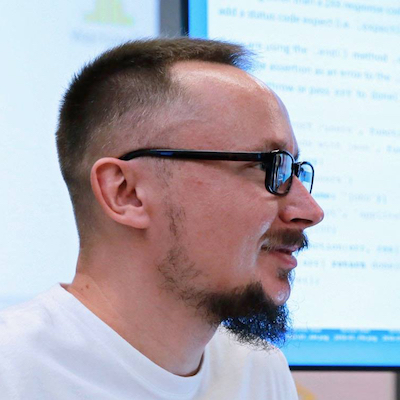 Rafał Pocztarski]
.card[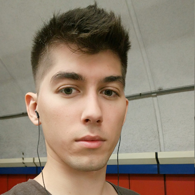 Piotr Szlachciak]

.card[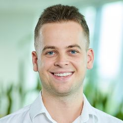 Przemysław Struciński]
.card[ Tomasz Budrewicz]

<!-- .card[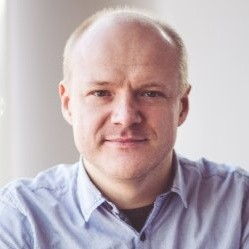 Łukasz Basaj] -->
<!-- .card[ Krzysztof Łokaj] -->
<!-- .card[ Bartosz Legięć] -->
<!-- .card[ Jacek Mikrut] -->

<!-- .card[ Piotr Kowalski] -->
<!-- .card[ Piotr Szlachciak] -->
<!-- .card[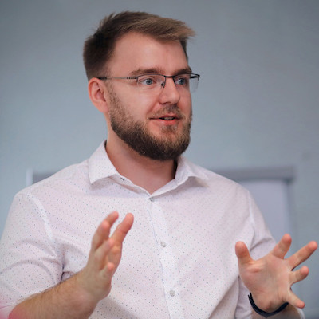 Michał Bury] -->

<!-- .card[ Robert Kawecki] -->
<!-- .card[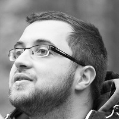 Kamil Grabek] -->
<!-- .card[ Łukasz Borawski] -->
<!-- .card[ Jakub Skałecki] -->
<!-- .card[ Michał Szklarski] -->

<!-- .card[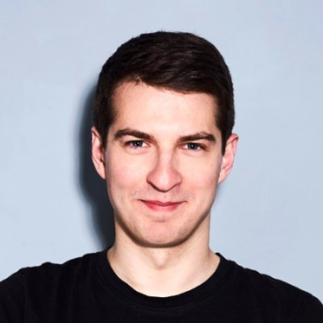 Paweł Mysior] -->
<!-- .card[ Tatiana Platonova] -->
<!-- .card[ Piotr Zientara] -->
<!-- .card[ Daniel Siwek] -->

<!-- .card[ Rafał Pocztarski] -->
<!-- .card[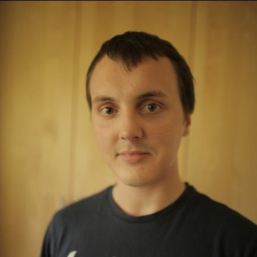 Łukasz Godziejewski] -->
<!-- .card[ Tomasz Budrewicz] -->
<!-- .card[ Piotrek Koszuliński] -->
<!-- .card[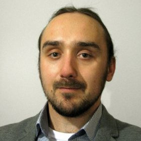 Krzysztof Syrytczyk] -->
<!-- .card[ Nataliya Pasichnyk] -->
<!-- .card[ Anna Guz] -->
<!-- .card[ Mateusz Chrzonstowski] -->
<!-- .card[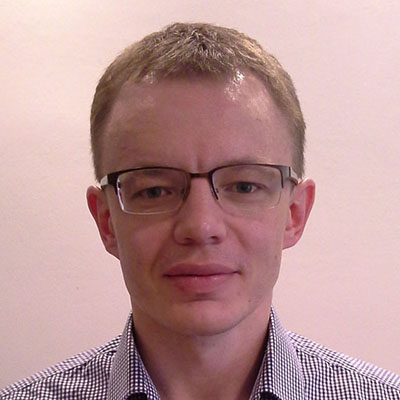 Andriy Mykulyak] -->
<!-- .card[ Marek Kirejczyk] -->
<!-- .card[ Bartłomiej Rutkowski] -->
<!-- .card[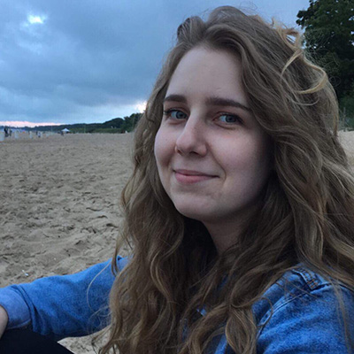 Justyna Broniszewska] -->
<!-- .card[ Kamil Gajowy] -->
<!-- .card[ Wojtek Przechodzeń] -->
<!-- .card[ Marcin Hagmajer] -->
<!-- .card[ Vivek Patel] -->

---

class: middle, center, slide-card-list, no-display-twitter-handle, no-logo

.size50[

# Trenerzy wspomagający

]

.card[ Natalia Kędziora]
.card[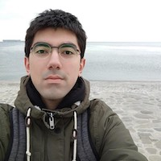 Genia Kai]
.card[]

<!-- .card[ Piotr Szlachciak] -->
<!-- .card[ Piotr Sławiński] -->
<!-- .card[ Nataliya Pasichnyk] -->
<!-- .card[ Tatiana Platonova] -->
<!-- .card[ Bartosz Legięć] -->
<!-- .card[ Łukasz Basaj] -->
<!-- .card[ Ula Kaźmierczyk] -->
<!-- .card[ Jacek Mikrut] -->
<!-- .card[ Piotr Łysik] -->
<!-- .card[ Kamil Gebała] -->
<!-- .card[ Natalia Kędziora] -->
<!-- .card[ Kinga Wigurska-Bąk] -->
<!-- .card[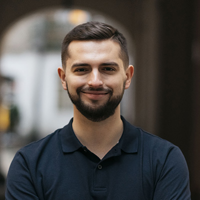 Przemysław Rząd] -->
<!-- .card[ Barbara Kłosowska] -->
<!-- .card[ Kamil Gajowy] -->
<!-- .card[ Konrad Kowalski] -->

---

class: middle, center, slide-middle-images, no-logo

.size50[

# Sponsorzy

]

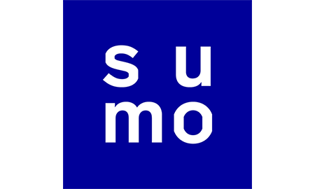
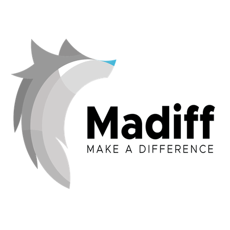

<!--  -->
<!--  -->
<!--  -->
<!--  -->
<!-- 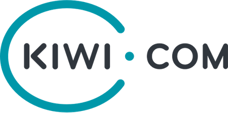 -->

---

class: middle, center, slide-middle-images, no-logo

.size50[

# Partnerzy

]

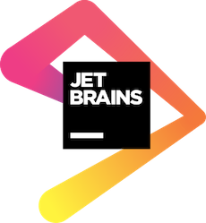

---

exclude: true
class: middle, center, slide-middle-images, no-logo

.size50[

# Thank you!

]

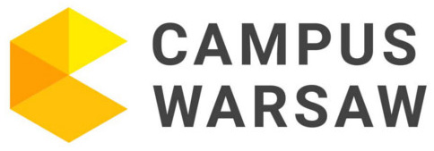
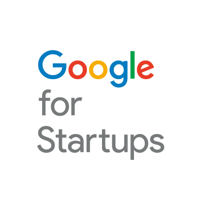

---

.size50[

# Zasady współpracy 📋

]

* Trener decyduje o prędkości realizacji projektu
* Zajęcia grupowe — pomagamy sobie nawzajem
* Odnosimy się do siebie po koleżeńsku

A najważniejsza zasada to...

---

class: middle, center

.size70[

# Żadne pytanie nie jest głupie!

]

---

class: middle, center, no-logo

# Slack

<svg width="200" height="200" viewBox="0 0 256 256" xmlns="http://www.w3.org/2000/svg" preserveAspectRatio="xMidYMid"><path d="M165.964 15.838c-3.89-11.975-16.752-18.528-28.725-14.636-11.975 3.89-18.528 16.752-14.636 28.725l58.947 181.365c4.048 11.187 16.132 17.473 27.732 14.135 12.1-3.483 19.475-16.334 15.614-28.217L165.964 15.838" fill="#DFA22F"/><path d="M74.626 45.516C70.734 33.542 57.873 26.989 45.9 30.879 33.924 34.77 27.37 47.631 31.263 59.606l58.948 181.366c4.047 11.186 16.132 17.473 27.732 14.132 12.099-3.481 19.474-16.332 15.613-28.217L74.626 45.516" fill="#3CB187"/><path d="M240.162 166.045c11.975-3.89 18.526-16.75 14.636-28.726-3.89-11.973-16.752-18.527-28.725-14.636L44.708 181.632c-11.187 4.046-17.473 16.13-14.135 27.73 3.483 12.099 16.334 19.475 28.217 15.614l181.372-58.93" fill="#CE1E5B"/><path d="M82.508 217.27l43.347-14.084-14.086-43.352-43.35 14.09 14.089 43.347" fill="#392538"/><path d="M173.847 187.591c16.388-5.323 31.62-10.273 43.348-14.084l-14.088-43.36-43.35 14.09 14.09 43.354" fill="#BB242A"/><path d="M210.484 74.706c11.974-3.89 18.527-16.751 14.637-28.727-3.89-11.973-16.752-18.526-28.727-14.636L15.028 90.293C3.842 94.337-2.445 106.422.896 118.022c3.481 12.098 16.332 19.474 28.217 15.613l181.371-58.93" fill="#72C5CD"/><path d="M52.822 125.933c11.805-3.836 27.025-8.782 43.354-14.086-5.323-16.39-10.273-31.622-14.084-43.352l-43.36 14.092 14.09 43.346" fill="#248C73"/><path d="M144.16 96.256l43.356-14.088a546179.21 546179.21 0 0 0-14.089-43.36L130.07 52.9l14.09 43.356" fill="#62803A"/></svg>

## #workshop-37

**Dostęp możliwy, kiedy dostaniesz zaproszenie.**

---

class: middle, center

.size70[

# Kto jest pierwszy raz na wydarzeniu?

]

---

# Przerwy 🏖

.size50[

* Social media break: **11:30 — 11:45**
* Lunch: **13:00 — 13:45**
* Activity break: **15:30 — 15:45**

]

Możliwe są dodatkowe przerwy, o których decyduje trener.

---

class: middle, center

# 💎 Nazwa projektu 💎

.size50[

## <mark>warsawjs-workshop-37-*</mark>

]

---

# Zakończenie

.size40[

* Kodowanie kończymy o **18:00**
* Ankieta: [bit.ly/warsawjs-workshop-37-ankieta](https://bit.ly/warsawjs-workshop-37-ankieta)
* **Zapraszamy na scenę, aby opowiedzieć o dzisiejszym doświadczeniu**
* &#x2728; Bonus na zakończenie! &#x2728;

]

---

class: middle, center

.size120[

# Poznajmy się &#x1F600;

]

---

exclude: true
class: middle, center, slide-card-list

### **WarsawJS** w mediach społecznościowych

.card[ [meetup.com](http://meetup.com/warsawjs)]
.card[ [twitter.com](http://twitter.com/warsawjs)]

.card[ [facebook.com](http://facebook.com/warsawjs)]
.card[ [youtube.com](http://youtube.com/warsawjs)]

---

class: middle

# Pokaż jak się koduje! ⌨️

## 1. Zrób zdjęcie podczas warsztatów 📲

## 2. Opublikuj w mediach z tagiem `#warsawjs`

## 3. Weź udział w losowaniu upominku! &#x1F455;

---

exclude: false
class: no-logo, slide-fullscreen-background
background-image: url(images/masterclass/Baner_Temat.png)

---

exclude: false
class: no-logo, slide-fullscreen-background
background-image: url(images/masterclass/Baner_Temat2.png)

---

exclude: false
class: no-logo, slide-fullscreen-background
background-image: url(images/confrontjs/Facebook_1920x1080px.jpg)

---

class: middle, center

# Koniec części organizacyjnej

<!-- Zapraszamy mentora na scenę 👨🏼‍🏫 -->
Zapraszamy do kodu! 👩‍💻 • 👨‍💻

---

class: middle, slide-invert-colors

# Kodowanie...

---

class: middle, center

# Odliczanie czasu do końca warsztatów

.size40[
[piecioshka.github.io/countdown/#10:00](https://piecioshka.github.io/countdown/#10:00)
]

---

class: middle, center

# Koniec &#x23F0; o <mark>18:00</mark>

---

class: middle

# [1/5] Ankieta 📑

## [bit.ly/warsawjs-workshop-36-ankieta](https://bit.ly/warsawjs-workshop-36-ankieta)

* Dziękujemy za wypełnienie ankiet
* Dzięki nim możemy się rozwijać
* Ankieta jest anonimowa

---

class: middle

# [2/5] Chwalimy się! &#x1F4A5;

## Wyjdźcie na scenę i opowiedzcie czego się dziś nauczyliście!

1. Opis podstawowych funkcjonalności (przeklikanie)
2. Najfajniejsze miejsce w kodzie
3. Jaki jest największy problem?

---

class: middle

# [3/5] Nagrody &#x1F381;

## Losowanie na podstawie zdjęć z `#warsawjs`

* [Twitter](https://twitter.com/hashtag/warsawjs?f=tweets&vertical=default)
* [Instagram](https://www.instagram.com/explore/tags/warsawjs/)
* [Facebook](https://www.facebook.com/hashtag/warsawjs)

---

class: middle

# [4/5] Certyfikaty 🏆

## ...dla trenerów!

* Bardzo dziękujemy za przygotowanie materiałów
* Za całodzienne przekazywanie swojej wiedzy
* Oraz że z uśmiechem opowiadaliście swoje doświadczenia

---

class: middle

# [5/5] Dziękujemy ❤️

* Trenerom regularnym,
* Trenerom wspomagającym,
* Wolontariuszom,
* Sponsorom

---

class: top, center, no-logo
background-image: url('images/community.jpg')

# <mark>Wspólne zdjęcie! 📸</mark>

---

class: middle, center, no-logo

.slide-card-list[

.card.size70[Dziękujemy za&nbsp;obecność!]
.card[]

]

<!-- Fullscreen background: 1210 x 681 -->
