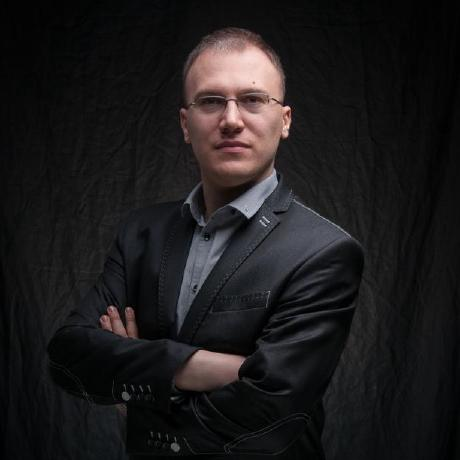
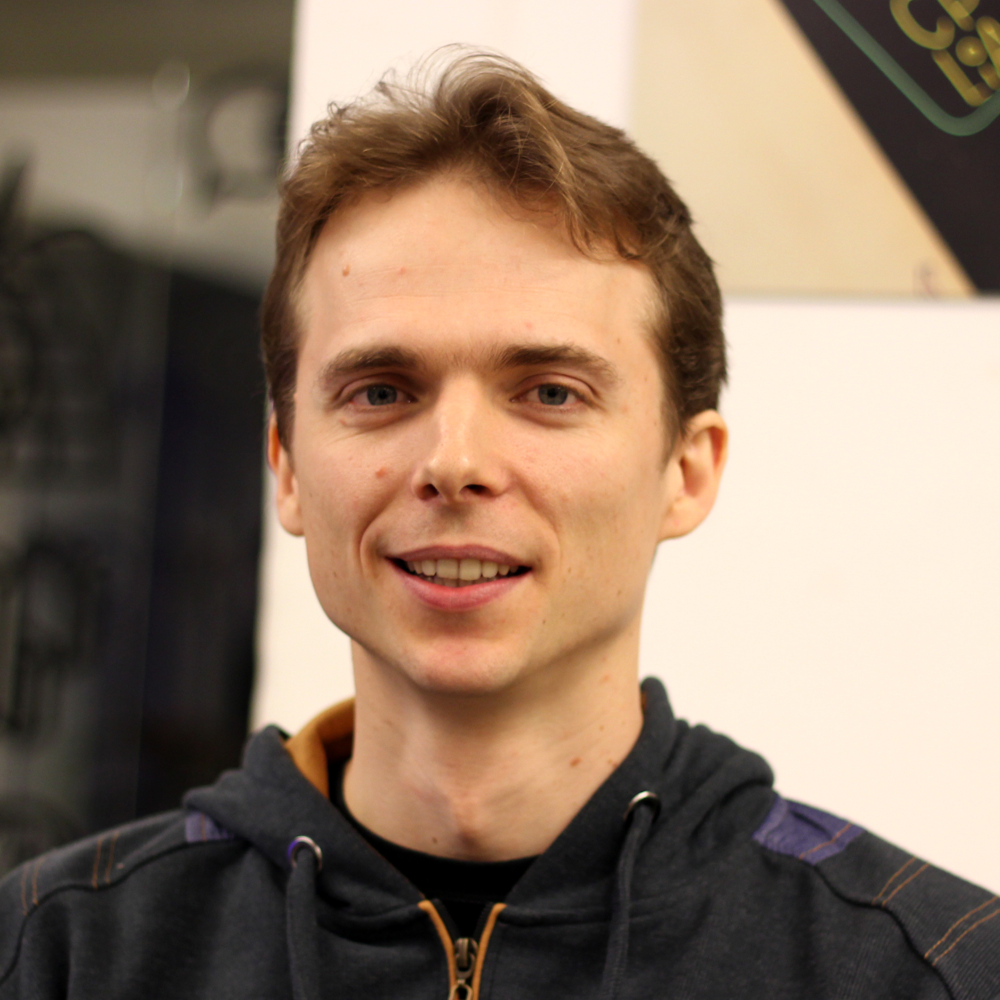

class: middle, center, slide-1

# WarsawJS Workshop #1

---

class: middle, center

# I część: organizacyjna

---

class: middle, center, slide-card-list

### Organizatorzy

.card[ Piotr Kowalski]
.card[ Katarzyna Grabowska]
.card[ Piotr Zientara]

---

class: middle, center, slide-card-list

### Trenerzy

.card[ Piotr Kowalski]
.card[ Piotr Zientara]
.card[ Rafał Gierczak]
.card[ Piotr Błaszczak]

---

class: middle, center

---

### Sprawy organizacyjne

* Opłata
* Systematyczne spotkania
* Trenerzy i mentor

---

### Zasady współpracy

* To nie są indywidualne zajęcia
* Odnosimy się do siebie po koleżeńsku (na Ty)
* Trener decyduje o prędkości realizacji projektu

---

class: middle, center

# Nie ma głupich pytań

---

class: middle, center

# Poznajmy się &#x1F600;

---

class: middle, center

# Koniec części organizacyjnej
